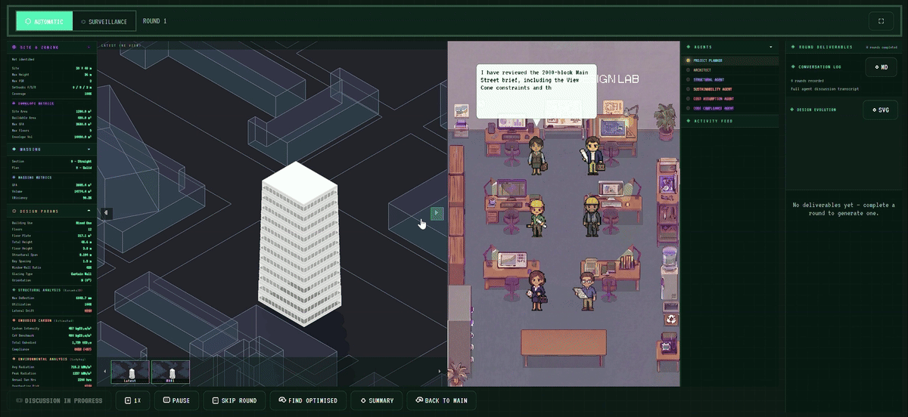
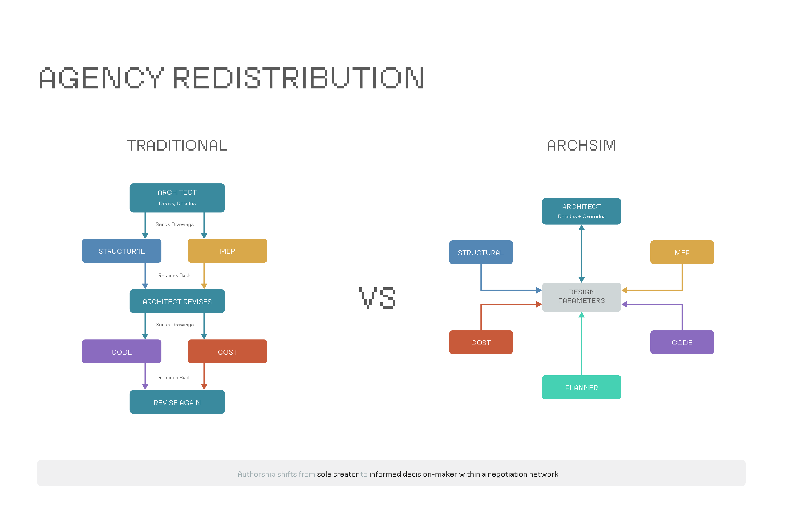
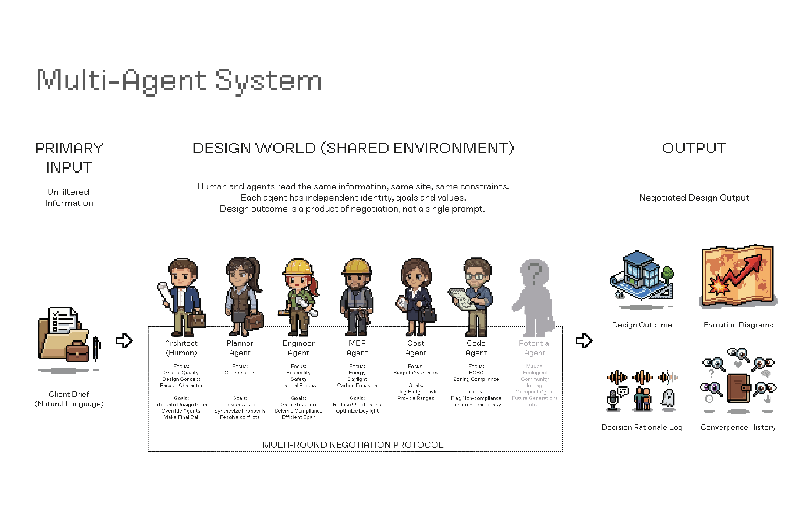
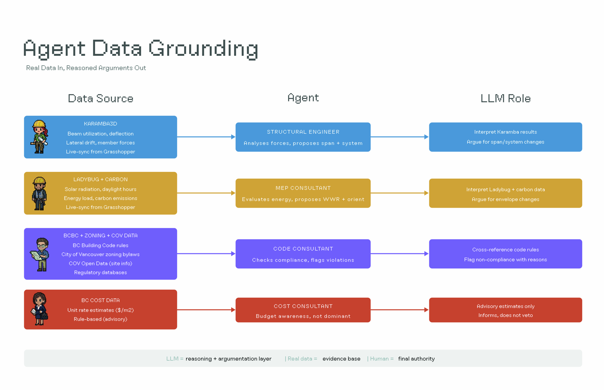
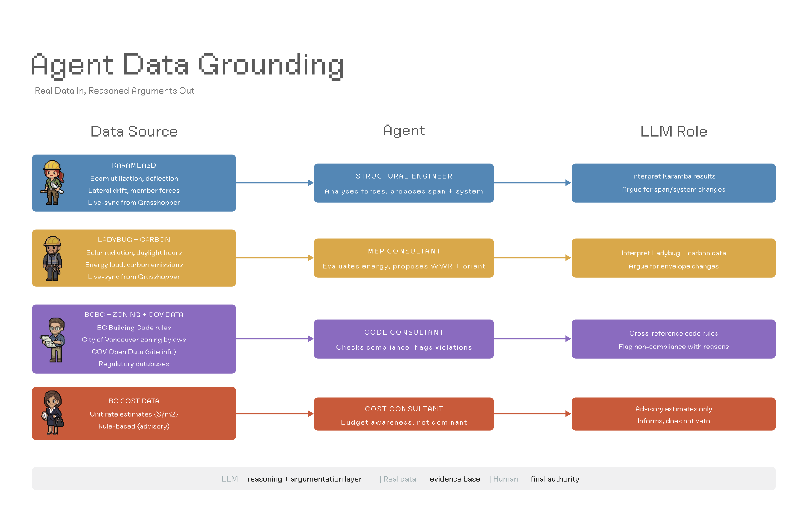
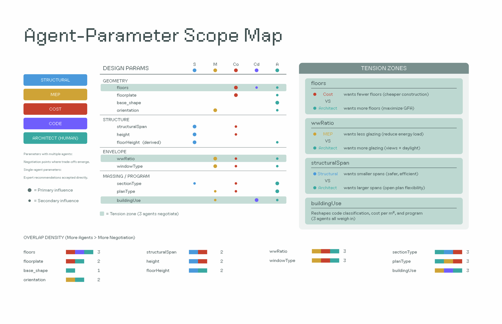
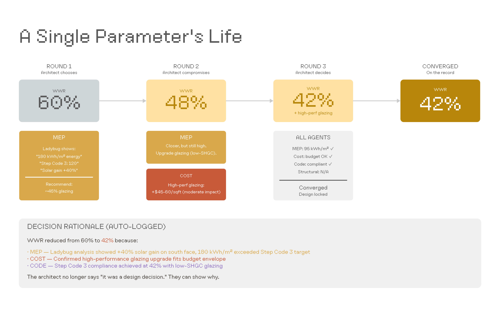
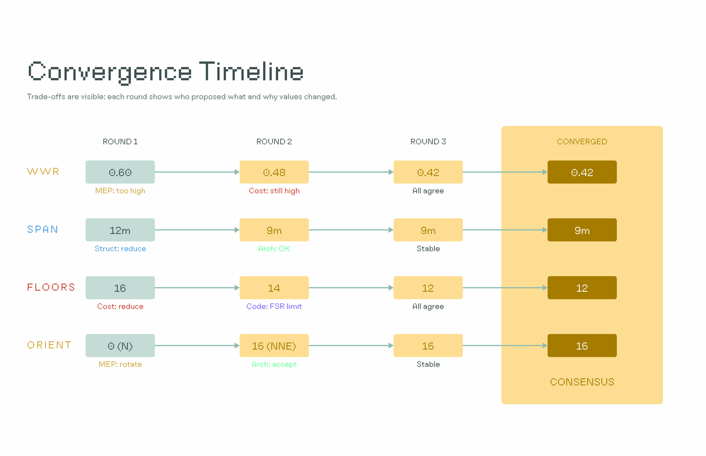

# ArchSim

**Multi-Agent AI for Early-Stage Architectural Design**

ArchSim is a working prototype of a multi-agent negotiation system for schematic architectural design. It pairs a reasoning layer of specialised AI consultants (Structural, MEP, Cost, Code) with an evidence layer of parametric simulation (Grasshopper + Karamba3D + Ladybug Tools), coordinated by a Planner agent and supervised by a human architect.

The system was developed as the constructive inquiry of *Who Designs: Architectural Agency Negotiating Between Humans and Machines* (UBC M.Arch thesis, 2026).

---

## Demo

<p align="center"></p>

Full-length recordings of complete schematic-design negotiations, run on the twelve-storey mixed-use Mount Pleasant tower brief:

- **[Automatic mode — full negotiation](https://github.com/karllamwn/ArchSim/releases/download/v0.1.0-demo/Auto_Edited.mp4)** — the Planner sequences the four consultants, the agents deliberate across three rounds, and FIND OPTIMISED consolidates the deliberation into a final design (auto-MDO mode).
- **[Manual mode — consultation in virtual office](https://github.com/karllamwn/ArchSim/releases/download/v0.1.0-demo/Manual_edited.mp4)** — the architect walks the first-person office scene, addresses each consultant directly, and parameters are picked one at a time through the step-by-step picker.

Both demos are also available on the [release page](https://github.com/karllamwn/ArchSim/releases/tag/v0.1.0-demo).

---

## What it does

- Takes a natural-language client brief and parses it into design parameters
- Sequences a round-based negotiation between four specialist AI agents
- Grounds each agent's reasoning in real engineering data (Karamba structural analysis, Ladybug environmental simulation, BC cost data, BC Building Code and City of Vancouver zoning bylaws)
- Records every design decision and the rationale behind it in an auditable **Decision Rationale Log**
- Produces a coordinated final design through a constrained Multi-Disciplinary Optimisation pass (FIND OPTIMISED)

---

## Try it

A live demo runs at **[karllamwn.github.io/ArchSim](https://karllamwn.github.io/ArchSim)** (front-end only — see below).

### Run locally with full Grasshopper integration

1. Clone the repository:
   ```bash
   git clone https://github.com/karllamwn/ArchSim.git
   cd ArchSim
   ```
2. Open [`grasshopper/ArchSim Script.gh`](grasshopper/ArchSim%20Script.gh) inside Rhino with [Karamba3D](https://karamba3d.com/) and [Ladybug Tools](https://www.ladybug.tools/) installed. See [`grasshopper/README.md`](grasshopper/README.md) for the bridge protocol.
3. Start the bridge server:
   ```bash
   python serve.py
   ```
4. Open `http://localhost:3000` in your browser.
5. Paste a Google Gemini API key on the splash screen (get one free at [aistudio.google.com/apikey](https://aistudio.google.com/apikey)). The key is stored in your browser's localStorage only — it is never transmitted to any server other than Google's Gemini API.

### Live demo limitations

The live demo on GitHub Pages runs the front-end only. Without a local Rhino + Grasshopper instance, agents operate on estimated data rather than live structural/environmental simulation results.

---

## Architecture

```
┌─────────────────┐     ┌─────────────────┐     ┌─────────────────┐
│   REASONING     │     │     DECIDING    │     │   ENGINEERING   │
│                 │     │                 │     │                 │
│   Agents        │ ◄─► │   Interface     │ ◄─► │   Grasshopper   │
│   (Gemini)      │     │   (Browser)     │     │   Karamba +     │
│                 │     │                 │     │   Ladybug       │
└─────────────────┘     └─────────────────┘     └─────────────────┘

   LLM reasoning            Architect             Real-time
   + argumentation          decides + ratifies    simulation
```

- **Reasoning layer:** Gemini API powers all agent dialogue
- **Interface layer:** browser-based UI (Phaser scene for first-person mode + parameter panels + 3D viewport)
- **Engineering layer:** Grasshopper definition with Karamba3D for structural analysis and Ladybug Tools for environmental simulation
- **Bridge:** `serve.py` (Python HTTP server) marshals data between the browser and Grasshopper via JSON snapshots and a round-token protocol

<p align="center"></p>
<p align="center"></p>
<p align="center"></p>
<p align="center"></p>

---

## Modes

- **Automatic** — agents work autonomously; architect ratifies each round
- **Manual** — first-person *Consultation in Virtual Office*; architect walks up to each consultant and addresses them directly
- **Surveillance** — six-pane grid showing every agent's prompts, reasoning, data calls, and outputs in real time

---

## Negotiation in practice

A negotiation round produces an auditable trail of every parameter change — *who proposed what, why values changed, where consensus was reached.*

<p align="center"></p>
<p align="center"></p>
<p align="center"></p>

---

## Project structure

```
ArchSim/
├── index.html                  Main entry — splash, brief, workspace, all screens
├── serve.py                    Python bridge between browser and Grasshopper
├── agents/                     Per-agent system prompts (Structural / MEP / Cost / Code / Planner)
├── api/                        Gemini API wrapper + Grasshopper HOPS interface
├── core/                       State management, params, history, round sync, GH sync
├── data/                       BCBC rules, BC unit-rate cost data
├── reference/                  Vancouver zoning regulations, code references
├── assets/                     Images, fonts, icons, Phaser scene assets
├── grasshopper/                Rhino + Grasshopper definition files (.gh)
├── picker/                     Step-by-step parameter picker UI
└── snapshots/                  Runtime artefacts (gitignored)
```

---

## Tech stack

- **Front-end:** Vanilla JavaScript with ES modules. No framework, no build step.
- **Reasoning:** Google Gemini API
- **Engineering:** Rhino 7+ with Grasshopper, Karamba3D, Ladybug Tools
- **Bridge:** Python 3 (standard library only)
- **Visualisation:** Phaser 3 for the first-person scene, Three.js for the 3D viewport

---

## License

MIT — see [LICENSE](LICENSE).

---

## Citation

If you build on this work academically, please cite:

> Karl Lam. *Who Designs: Architectural Agency Negotiating Between Humans and Machines.* Master of Architecture thesis, University of British Columbia, 2026.
